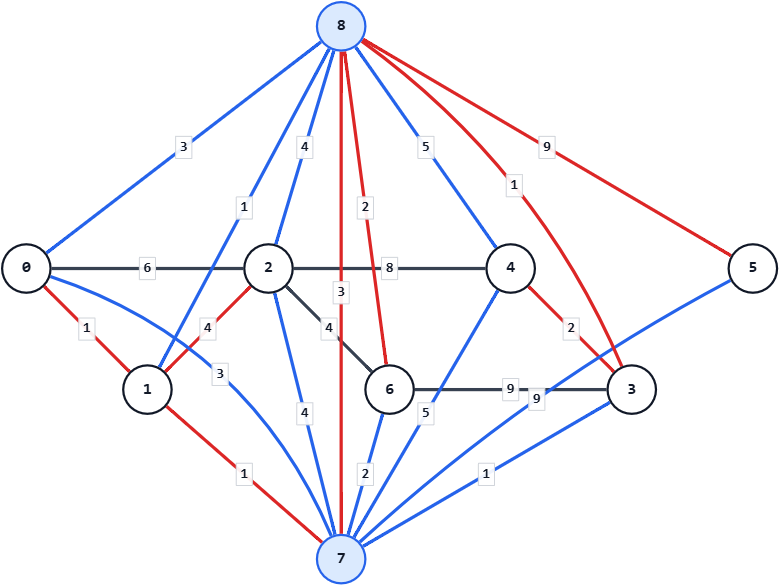

## 考え方

基本的なDijkstra法の問題に、ワープが加わっただけ。

都市 $i$ から都市 $j$ へワープするコストは $X_i+X_j+Y$ かかる。
これは、以下のように解釈することができる。
- 都市 $i$ 内で、都市中心からワープ装置がある場所へ行くのに $X_i$ 分かかる
- ワープそのものに $Y$ 分かかる
- 都市 $j$ 内で、ワープ装置がある場所から都市中心に帰るのに $X_j$ 分かかる

すると、以下の $2$ つの超頂点を追加することで、これは素直に扱えるようになる。
- ワープ装置の使用前を表す頂点
  - 全ての都市の装置をまとめて $1$ つの頂点で表す
  - どこの都市からでも $X_i$ 分で来れるが、ここからは「ワープ使用後」にしか行けない
- ワープ装置の使用後を表す頂点
  - 全ての都市の装置をまとめて $1$ つの頂点で表す
  - どこの都市へも $X_i$ 分で行けるが、ここへは「ワープ使用前」からしか来られない

ここが解決したら、あとはDijkstra法を行うだけで解ける。
辺の数が $M+2N+1$ 本あるので、計算量は $O((N+M) \log (N+M))$。

## 入力例1での動作

入力を受け取り、都市番号を `0-indexed` に直す。
```
n: 7
m: 7
y: 3
u: {0, 0, 1, 2, 2, 3, 3}
v: {1, 2, 2, 4, 6, 4, 6}
w: {1, 6, 4, 8, 4, 2, 9}
x: {3, 1, 4, 1, 5, 9, 2}
```

都市 $0$ から都市 $6$ に加えて、超頂点を $2$ つ用意する。

- 頂点 $7$: ワープ入口
- 頂点 $8$: ワープ出口

隣接リストは、「重み、行き先頂点」の形で持つ。

まず、通常の道路を隣接リストに追加する。
道路は双方向なので、両向きの辺を追加する。

次に、各都市 $i$ について、都市 $i$ から超頂点 $7$ へ重み `x[i]` の辺を張る。
また、超頂点 $8$ から都市 $i$ へ重み `x[i]` の辺を張る。
最後に、超頂点 $7$ から超頂点 $8$ へ重み $y$ の辺を張る。

超頂点を含めた隣接リストは次のようになる。
```
graph[0]: {(1,1), (6,2), (3,7)}
graph[1]: {(1,0), (4,2), (1,7)}
graph[2]: {(6,0), (4,1), (8,4), (4,6), (4,7)}
graph[3]: {(2,4), (9,6), (1,7)}
graph[4]: {(8,2), (2,3), (5,7)}
graph[5]: {(9,7)}
graph[6]: {(4,2), (9,3), (2,7)}
graph[7]: {(3,8)}
graph[8]: {(3,0), (1,1), (4,2), (1,3), (5,4), (9,5), (2,6)}
```

都市 $0$ からDijkstra法を実行し、最短距離を求める。
```
result: {0, 1, 5, 6, 8, 14, 7, 2, 5}
```

答えとして、都市 $1$ から都市 $6$ までの、都市 $0$ からの最短距離 `1 5 6 8 14 7` を出力する。


灰色の辺は通常の道路。
青い部分はワープ経路（一部、赤で色が上書きされている）。
赤い部分はDijkstra法で求めた各都市への最短経路。
$7$→$8$ は実際はこの向きの有向辺。
頂点 $7$ へ向かう辺は、$7$→$8$ を除き、実際は $7$ への有向辺。
頂点 $8$ から出る辺は、$7$→$8$ を除き、実際は $8$ からの有向辺。

## 注意点

最短距離は、$10^9$ 級の値をいくつも足すので、`int` 型からはみ出る。
`long long` 型を用いること。

## 別解

超頂点を $1$ つで解く方法もある。
ワープ装置へ行くのに $X_i+Y$、ワープ装置から帰るのに $X_i$ とすればよい。

さらに、有向辺と無向辺が入り混じることを嫌うなら、コストを全て $2$ 倍にする方法もある。
都市間の経路のコストは全て $2$ 倍、ワープ装置との行き来は $2X_i+Y$ とする。
こうすると、全て無向辺で扱うことができる。
$2X_i+Y$ が `int` 型に収まらなくなったり、最後に半分にする必要があったりする代償はあるが。

