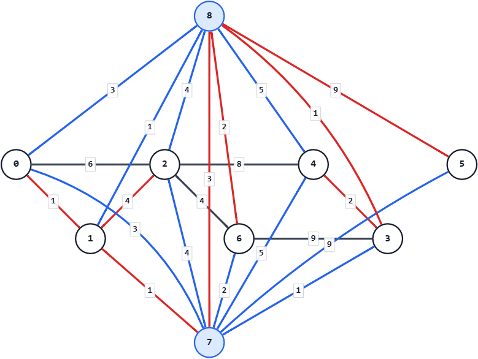

## 考え方

基本的なDijkstra法の問題に、ワープが加わっただけ。

都市 $i$ から都市 $j$ へワープするコストは $X_i+X_j+Y$ かかる。
これは、以下のように解釈することができる。
- 都市 $i$ 内で、都市中心からワープ装置がある場所へ行くのに $X_i$ 分かかる
- ワープそのものに $Y$ 分かかる
- 都市 $j$ 内で、ワープ装置がある場所から都市中心に帰るのに $X_j$ 分かかる

すると、以下の $2$ つの超頂点を追加することで、これは素直に扱えるようになる。
- ワープ装置の使用前を表す頂点
  - 全ての都市の装置をまとめて $1$ つの頂点で表す
  - どこの都市からでも $X_i$ 分で来れるが、ここからは「ワープ使用後」にしか行けない
- ワープ装置の使用後を表す頂点
  - 全ての都市の装置をまとめて $1$ つの頂点で表す
  - どこの都市へも $X_i$ 分で行けるが、ここへは「ワープ使用前」からしか来られない

ここが解決したら、あとはDijkstra法を行うだけで解ける。
辺の数が $M+2N+1$ 本あるので、計算量は $O((N+M) \log (N+M))$。

## 入力例1での動作

入力を受け取る。
都市番号は受け取った値から $1$ を引いて `0-indexed` にしておく。

```text
n: 7
m: 7
y: 3
(u, v, w): {
  (0, 1, 1),
  (0, 2, 6),
  (1, 2, 4),
  (2, 4, 8),
  (2, 6, 4),
  (3, 4, 2),
  (3, 6, 9)
}
x: {3, 1, 4, 1, 5, 9, 2}
```

都市 $0$ から都市 $6$ に加えて、ワープ使用前を表す超頂点 $7$ と、ワープ使用後を表す超頂点 $8$ を用意する。

通常の道路はそのまま双方向の辺として使う。
ワープについては、各都市 $i$ から超頂点 $7$ へ重み $X_i$ の辺を張る。
また、超頂点 $8$ から各都市 $i$ へ重み $X_i$ の辺を張り、超頂点 $7$ から $8$ へ重み $Y=3$ の辺を張る。

例えば都市 $1$ から都市 $6$ へワープする経路は、

```text
都市1 → 超頂点7 → 超頂点8 → 都市6
```

となり、コストは $X_1+Y+X_6=1+3+2=6$ となる。

このグラフで都市 $0$ を始点としてDijkstra法を行う。
最終的な最短距離は次のようになる。

<!-- table-row-header: false -->
| 頂点 | $0$ | $1$ | $2$ | $3$ | $4$ | $5$ | $6$ | 超頂点 $7$ | 超頂点 $8$ |
| :--- | ---: | ---: | ---: | ---: | ---: | ---: | ---: | ---: | ---: |
| 最短距離 | $0$ | $1$ | $5$ | $6$ | $8$ | $14$ | $7$ | $2$ | $5$ |

したがって、都市 $1$ から都市 $6$ までの、都市 $0$ からの最短距離は $1,5,6,8,14,7$ となる。



灰色の辺は通常の道路。
青い部分はワープ経路（一部、赤で色が上書きされている）。
赤い部分はDijkstra法で求めた各都市への最短経路。
$7 \to 8$ は実際はこの向きの有向辺。
頂点 $7$ が関わる辺は、$7 \to 8$ を除き、実際は $7$ への有向辺。
頂点 $8$ が関わる辺は、$7 \to 8$ を除き、実際は $8$ からの有向辺。

## 注意点

最短距離は、$10^9$ 級の値をいくつも足すので、`int` 型からはみ出る。
`long long` 型を用いること。

## 別解

超頂点を $1$ つで解く方法もある。
ワープ装置へ行くのに $X_i+Y$、ワープ装置から帰るのに $X_i$ とすればよい。

さらに、有向辺と無向辺が入り混じることを嫌うなら、コストを全て $2$ 倍にする方法もある。
都市間の経路のコストは全て $2$ 倍、ワープ装置との行き来は $2X_i+Y$ とする。
こうすると、全て無向辺で扱うことができる。
$2X_i+Y$ が `int` 型に収まらなくなったり、最後に半分にする必要があったりする代償はあるが。
