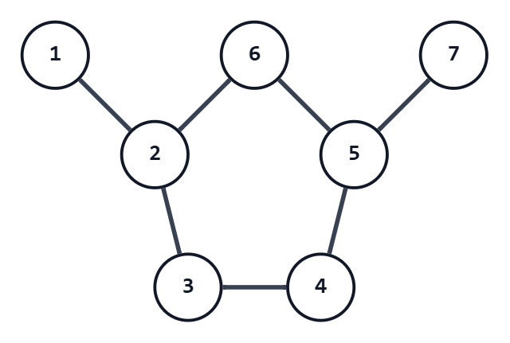

## 考え方

「奇数長の閉路が存在するか？」は「二部グラフとして破綻しているか」と同値。
よって、判定だけなら何らかの二部グラフ判定方法を実行すればよい。
しかし、今回の問題ではその閉路を $1$ つ答えなければならず、判定方法によってはそちらが困難になる。

そこで、幅優先探索と最近共通祖先の考え方を用いる。

まず、幅優先探索を用いて、グラフ上に根付き木を作る。
つまり、ある頂点を基準に、各頂点からその頂点へ向かう最短路を考える。
そして、「基準点までに経由する辺の数」「最短路で次に行くべき頂点」を記録しておく。

さて、根付き木の距離情報が偶数である頂点を白、奇数である頂点を黒で塗ると考える。
元々のグラフに奇数長の閉路があった場合、パリティの都合でどこかで同じ色同士が辺で結ばれている。
もちろん、その辺は根付き木には採用されなかった辺ということになるのだが。

そして、ここで、幅優先探索で作った根付き木の性質が意味を持つ。
幅優先探索では、元々のグラフの全ての辺は、必ず結ぶ頂点の距離情報の差が $1$ 以下となっている。
ということは、同じ色同士が辺で結ばれているところは、全く同じ距離の点同士を結んでいることになる。

さて、それを $X_1$ と $Y_1$ としよう。
それらから最短路で基準点に $1$ つずつ移動した点を $X_2$ と $Y_2$ とする。
以下同様に、$X_k$ と $Y_k$ と名付けていくと、どこかで最近共通祖先 $Z$ で両者が一致する。
（根付き木上で同じ深さからスタートしているため、通常の最近共通祖先の高度なアルゴリズムは不要）

このとき、$Z-X_1$ 間と $Z-Y_1$ 間には同じ長さの経路が存在する。
そして、 $X_1-Y_1$ 間には長さ $1$ の経路が存在する。
したがって、これら $3$ つの経路をぐるりと回れば奇数長閉路の一例ができることになる。

計算量は、$O(N+M)$ である。

## 具体例での動作

次の $1$ テストケースを考える。

```text
1
7 7
1 2
2 3
2 6
3 4
4 5
5 6
5 7
```


頂点 $1$ を根として幅優先探索すると、距離と親は次のようになる。

| 頂点 | 距離 | 親 |
|---:|---:|---:|
| $1$ | $0$ | なし |
| $2$ | $1$ | $1$ |
| $3$ | $2$ | $2$ |
| $4$ | $3$ | $3$ |
| $5$ | $3$ | $6$ |
| $6$ | $2$ | $2$ |
| $7$ | $4$ | $5$ |

入力された辺を順に調べると、辺 $(4,5)$ の両端はどちらも距離 $3$ である。
同じ距離の頂点同士を結んでいる辺として、これを用いて閉路を構築する。

$X_1=4$, $Y_1=5$ とする。
両方から親を同時にたどると、

- $4,5$ から $3,6$ へ進む
- $3,6$ から $2,2$ へ進み、頂点 $2$ で一致する

ので、最近共通祖先は頂点 $2$ である。

コードでは $4$ 側を答えの前側、$5$ 側を後ろ側へ追加していくため、頂点列は $2,3,4,5,6$ となる。

## 注意点

特になし。

## 別解

特になし。
