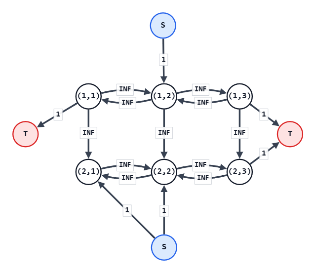

## 考え方

選択するのが $1$ 回なら、動的計画法で $O(HW)$ で解ける。
しかし、マスをいくつも選択するとなると、話はだいぶ難しくなる。

とはいえ、以下の特徴を見ると、これは最大閉包問題であることがわかる。
- 各マスについて `'#'` に「する」か、「しない」かの $2$ 択が用意されている
- あるマスで「する」を選択すると、別のマスでも「する」が強制される。

ということで、あとは最大閉包問題の解き方に従えばよい。

まず、$HW+2$ 個の頂点を持つ最大流グラフを用意する。
$HW$ 個は各マスに対応する用、$2$ 個はフローの源 $S$ と行先 $T$ 用。
その後、`'#'` ではない各マス $(i,j)$ について、以下で辺を張っていく。
- 下および左右のマスが `'#'` でない場合、$(i,j)$ からそのマスへ、十分に大容量な辺を張る
  - $(i,j)$ で「する」を選択した場合に、「する」が強制されることを意味する
- 自身が `'+'` である場合、$(i,j)$ から $T$ へ容量 $1$ の辺を張る
  - そこで「する」を選択すると $1$ 損することを意味する
- 自身が `'-'` である場合、$S$ から $(i,j)$ へ容量 $1$ の辺を張る
  - そこで「する」を選択すると $1$ 得することを意味する

これで最大流を求めれば、それが「制約を無視したことで不当に得た利益」となる。
つまり、それを `'+'` の個数から引けば、答えとなる。

最大流を解くのに AtCoder Library（Dinic法）を用いた場合、計算量は $O((HW)^3)$ である。

## 入力例1での動作

入力は以下である。

```text
2 3
+-+
--+
```

`'+'` は $(1,1),(1,3),(2,3)$ の $3$ マスなので、まず制約を無視した最大得点として $3$ を持っておく。

各マスに対応する頂点に加えて $S,T$ を用意する。
容量 $1$ の辺は以下のように張られる。

- $(1,1),(1,3),(2,3)$ から $T$ へ容量 $1$ の辺
- $S$ から $(1,2),(2,1),(2,2)$ へ容量 $1$ の辺

また、左右に隣接するマスの間には両方向に大容量辺が張られる。
上下に隣接するマスについても、上のマスから下のマスへ大容量辺が張られる。

以下が完成したグラフである。
ただし、辺の交錯を防ぐため、$S$ （青色）と $T$ （赤色）は複数の箇所に表現してある。
もちろん実際は $S$ も $T$ もそれぞれが全て同一頂点である。


このグラフの最大流は $2$ である。
したがって、答えは $3-2=1$ となる。

## 注意点

特になし。

## 別解

特になし。
