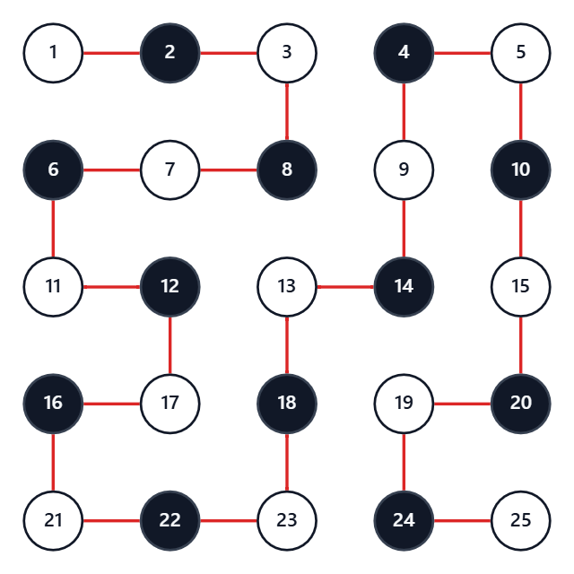
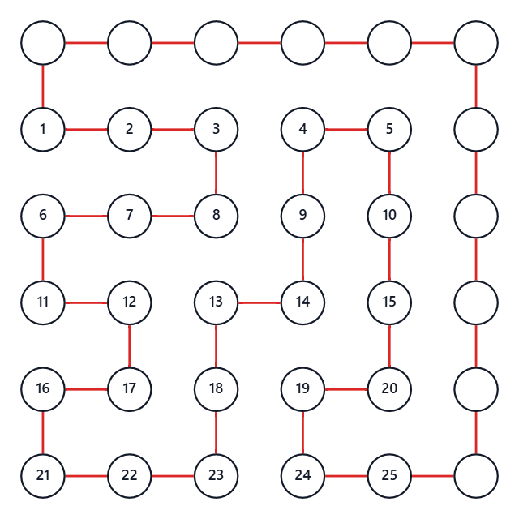
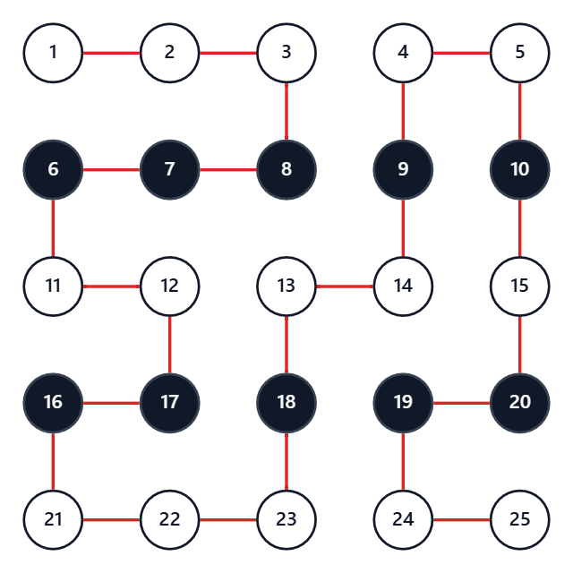

## 考え方

まず、いくつかの小さめの $N$ と $K$ で実験してみる。
すると、以下の $3$ つが構築可能な必要十分条件らしいと予想される。
- $N$ が奇数である
- $N-1 \leq K \leq (N^2-1)/2$ である
- $K$ が偶数である

そして、これは実際に正しく、$3$ 条件を満たすならば以下の手順で構築できる。（証明は後述）
- $K$ 回の右移動を、最後に余ったスペースを埋める $N-1$ 回分と残り分にわける
- 残り分を使い果たすまで、上の段から順に使って左右に蛇行する
  - 半端なところで使い果たした場合、その場で一段下がって最左列まで戻る
- 左の縦列を下へ向かって、左下のマスへ移動する
- 残り部分を左列から順に、上下に蛇行して余ったスペースを全て埋める

計算量は $O(N^2)$ である。
証明なしのワンチャン狙いで出して `AC` を取るまでは、G問題と思えないくらい簡単。

問題は、ここから。
本当にこの $3$ 条件は必要条件であるのかを証明しなければならない。
（十分性は、実際に構築したものが条件を満たすかどうか確認するだけで簡単なので省略）

### 必要性の証明 $1$

「$N$ が奇数である」の必要性の証明。

盤面のマスを頂点に置き換えて考える。
以下のように、スタート地点を白として、市松模様に塗ってみる。

すると、スタート地点もゴール地点も、白い頂点ということになる。
すなわち、全体の頂点数は奇数でなくてはならない。
よって、$N$ は奇数である必要がある。

### 必要性の証明 $2$

「$N-1 \leq K \leq (N^2-1)/2$ である」の必要性の証明。

右に移動する回数を問題通りに $K$、左に移動する回数を $L$ とする。
このとき、今左から何列目にいるかを考えることにより、$K-L=N-1$ でなければならない。
$L$ は非負であるから、$K \geq N-1$ である必要がある。

また、上に移動する回数を $U$、下に移動する回数を $D$ とする。
すると同様に $D-U=N-1$ であるから、$D-U=K-L$ つまり $K+U=D+L$ である。
ところで、明らかに $K+L+U+D=N^2-1$ なので、$K+U=(N^2-1)/2$ である。
$U$ は非負であるから、 $K \leq (N^2-1)/2$ である必要がある。

### 面積等分の証明

次の証明の前に $1$ つ補題を証明する。
以下、$N$ が奇数であることは前提とする。

それは、マス目中央同士を結ぶ $(N-1)\times (N-1)$ グリッドの面積等分性について。
全頂点を経由してスタートからゴールまでの移動経路を有向線として考える。
このとき、このグリッドは線の左右に分断される。
その左側の面積と右側の面積は、実は互いに等しく $(N-1)^2/2$ となっている。
これを証明する。

下図のように、右と上に $1$ 列付け加えて、閉路にする。

この閉路は、$(N+1)^2$ 個の格子点を $1$ 回ずつ通り、内部に頂点を含まない。
したがってピックの定理より、これが囲む面積は $(N+1)^2/2-1$ である。
このうち、頂点を付け足したことによる面積拡張が $2N-1$ だけある。
したがって、有向線の左側にある部分の面積は $(N+1)^2/2-1-(2N-1) = (N-1)^2/2$ である。
それは、マス目中央同士を結ぶ $(N-1)\times (N-1)$ グリッドの面積のちょうど半分となっている。

今回は、等分性というよりも、その $(N-1)^2/2$ が偶数であることを以下の証明で用いる。

### 必要性の証明 $3$

「$K$ が偶数である」の必要性の証明。
以下、$N$ が奇数であることは前提とする。

盤面のマスを頂点に置き換えて考える。
以下のように、最上段を白として、縞模様に塗ってみる。

そして、白から白へ向かう辺の個数を $W$、黒から黒へ向かう辺の個数を $B$ とする。

この塗り方において、前項の面積から、以下のように経路の得点を考察する。
- 同色を結ぶ辺のうち、右へ向かうものは、その上にある辺の数だけプラスの得点
- 同色を結ぶ辺のうち、左へ向かうものは、その上にある辺の数だけマイナスの得点

例えば、上の経路であれば、以下のようになる。
- $1\to 2$ の辺で $0$ 点獲得して $0$ 点
- $2\to 3$ の辺で $0$ 点獲得して $0$ 点
- $3\to 8$ の辺で $0$ 点獲得して $0$ 点
- $8\to 7$ の辺で $-1$ 点獲得して $-1$ 点
- $7\to 6$ の辺で $-1$ 点獲得して $-2$ 点
- $6\to 11$ の辺で $0$ 点獲得して $-2$ 点
- $11\to 12$ の辺で $+2$ 点獲得して $0$ 点
- $12\to 17$ の辺で $0$ 点獲得して $0$ 点
- $17\to 16$ の辺で $-3$ 点獲得して $-3$ 点
- 中略
- $24\to 25$ の辺で $+4$ 点獲得して $+8$ 点

これは、計算方法を考えれば、有向線の左側にある部分の面積に等しい。
つまり、右へ向かうときにはその上の幅 $1$ の長方形をくっつけ、左のときは取り除いていると考える。
すると、最終的に有向線の左側にある部分が残るのである。
よって、前項の補題より、この総得点は偶数である。

ところで、各辺ごとに加算しているとき、偶奇が入れ替わるのは黒同士を結ぶ辺を通るときだけである。
したがって、$B$ は偶数である。

一方でもう $1$ つ、以下のように経路の得点を考える。
- 白の頂点に到着するとき、および出発するときに $+1$ 点
- 黒の頂点に到着するとき、および出発するときに $-1$ 点

例えば、上の経路であれば、以下のようになる。
- $1$ 番の頂点を出発するときに $+1$ 点獲得して $+1$ 点
- $2$ 番の頂点に到着するときに $+1$ 点獲得して $+2$ 点
- $2$ 番の頂点を出発するときに $+1$ 点獲得して $+3$ 点
- $3$ 番の頂点に到着するときに $+1$ 点獲得して $+4$ 点
- $3$ 番の頂点を出発するときに $+1$ 点獲得して $+5$ 点
- $8$ 番の頂点に到着するときに $-1$ 点獲得して $+4$ 点
- $8$ 番の頂点を出発するときに $-1$ 点獲得して $+3$ 点
- $7$ 番の頂点に到着するときに $-1$ 点獲得して $+2$ 点
- 中略
- $25$ 番の頂点に到着するときに $+1$ 点獲得して $+8$ 点

すると、経路の総得点は $2$ つの方法で表すことができる。

$1$ つめ、各頂点に注目する。
白頂点は黒頂点よりも $1$ 行分すなわち $N$ 個多い。
そしてスタート地点への到着と、ゴール地点からの出発がない。
これらを考慮すると、総得点は $2N-2$ 点となる。

$2$ つめ、各辺に注目する。
白頂点と黒頂点を結ぶ辺は、得点が打ち消しあって $0$ 点。
白頂点同士なら $+2$ 点で、黒頂点同士なら $-2$ 点。
これらを考慮すると、総得点は $2W-2B$ 点となる。

よって、$2W-2B=2N-2$ つまり $W-B-(N-1) = 0$ となる。

これら $2$ つのパターンでの得点の考察から、$W+B-(N-1) = 2B$ は $4$ の倍数である。

さて、今度は移動方向の左右を考える。
右に移動する回数を問題通りに $K$、左に移動する回数を $L$ とする。
明らかに $K+L=W+B$ なので、$K+L-(N-1)$ は $4$ の倍数である。

一方で、$K-L=N-1$ なので、$L$ を消去して、$2K-2(N-1)$ は $4$ の倍数である。
そして $N-1$ は偶数なので、$K$ は偶数である必要がある。

以上により、以下の $3$ つは全て必要条件であることが示された。
- $N$ が奇数である
- $N-1 \leq K \leq (N^2-1)/2$ である
- $K$ が偶数である

## 入力例1での動作

入力例1には $3$ 個のテストケースがある。

$1$ 番目は $N=3,\ K=4$ である。
$N$ は奇数、$K$ は偶数で、$2\leq K\leq4$ を満たすので構築可能である。

最後の上下蛇行に使う $N-1=2$ 回の右移動を予約すると、残りの右移動回数は $2$ 回となる。
この $2$ 回を使って最上段を右端まで進み、一段下がって左端まで戻り、さらに一段下がる。
ここまでの操作列は `RRDLLD` となる。
残り部分では右へ $2$ 回進めば全マスを埋められるので、最終的な操作列は `RRDLLDRR` となる。

$2$ 番目は $N=2,\ K=1$ である。
$N$ が偶数なので必要条件を満たさず、`No` となる。

$3$ 番目は $N=5,\ K=10$ である。
最後の上下蛇行に使う $4$ 回を予約すると、残りは $6$ 回となる。
まず $4$ 回分を使って `RRRRDLLLLD` と左右に蛇行する。
さらに、残った $2$ 回分について `RRDLLD` と途中まで進んで折り返す。
その後、残り部分を上下に蛇行すると `RRRUURDD` が続き、操作列は `RRRRDLLLLDRRDLLDRRRUURDD` となる。

## 注意点

特になし。

## 別解

特になし。
