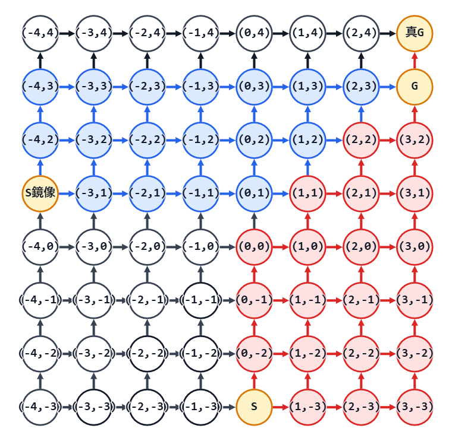

## 考え方

初期手札を取る前のすべての山札の並び順について、その順での最終枚数の総和を求める。
途中で終わる場合と、最後まで引ききる場合に分けて考える。

途中で終わる場合、途中で「普通カードをドローカードより $k$ 枚以上多く引いた」になったところで終了。
このパターン数は、カタラン数の考え方を一般化することで求められる。

これまで引いたドローカードが $x$ 枚、普通カードが $y$ 枚とする。
初期手札を含めて $1$ 枚ずつドローし、各カードを引いた枚数に応じて座標 $(x,y-k+1)$ を対応させる。
するとこのゲームは $(0,-k+1)$ から、点が $1$ ずつ右や上に動いていく様子として表現できる。
この経路が、一度も直線 $y=x$ より上に出ないまま $(i,i)$ に到達し、さらに $(i,i+1)$ に行ったとする。 
それは、$i$ 回ドローするまでゲームが続けられたが、$i$ 回目で引ききれずに終了することに対応する。

つまり、初期手札+追加ドローのパターン数は、カタラン数の一般化されたものである。
カタラン数はスタートもゴールも $y=x$ 上だが、ここではスタートは一般の地点 $(0,-k+1)$ である。
とはいえ、考え方は通常のカタラン数と同じで、$y=x+1$ での鏡像を利用して求めることができる。

そして、これにさらに、残った山札の並び順のパターン数をかける。
以上で $i$ 回目で山札が残っているのに途中終了するパターン数が出る。
これにこのときの最終手札数 $k+i$ をかけたものが $i$ 回目途中終了の寄与である。
これを、途中終了になる範囲の $i$ で総和を取れば、山札が残る分の寄与になる。

山札が残らないパターン数は、残ったものと考える。
つまり、全並び方 ${}_{a+b}\mathrm{C}_{b}$ から途中終了する数（山札の並び順をかけたところ）の総和を引けばよい。
最後に手札に残る枚数は明らかに $b$ 枚なので、それらをかけあわせれば山札が残らない分の寄与になる。

これで、初期手札を取る前のすべての山札の並び順について、その順での最終枚数の総和が求まった。
あとは、期待値にするために ${}_{a+b}\mathrm{C}_{b}$ で割れば答え。

## 入力例1での動作

$4$ つ目のテストケースのみ考える。

入力を受け取る。

```text
a: 20
b: 10
k: 4
```

全てのカードの並べ方を数えておく。

${}_{20+10}\mathrm{C}_{20}=30045015$

```text
count: 30045015
```

ここから、途中で終了する並べ方の数を引いていく。

たとえば、$i=3$ の場合を考える。
ドロー $3$ 回で山札が残ったまま終了するパターン数は、下の図で考える。

図では、赤い点と矢印は $S=(0,-3)$ から進む経路、青い点と矢印は $S$ 鏡像 $=(-4,1)$ から進む経路。
黒い点と矢印は今回の計算では使わない範囲を表す。
$G=(3,3)$ に到達する全経路から、直線 $y=x$ を超えてしまう経路を鏡像で対応させたものを引く。
（実際には、$(3,3)$ を経由して $G=(3,4)$ へ行って終了するパターン数を出している）



カードを引く順を、$(0,-3)$ から $(3,3)$ への一般化カタラン数で、${}_{9}\mathrm{C}_{6}-{}_{9}\mathrm{C}_{7}=84-36=48$ 通り。
これに残りの山札の順番 ${}_{20}\mathrm{C}_{17}=1140$ 通りをかけて、全 $48\times 1140=54720$ 通り。
この場合、最終手札枚数は $4+3=7$ 枚なので、スコア合計に $54720\times 7$ を加える。

同様に、途中で終了するパターン数は以下の表のようになる。

| $i$ | 始点 | 終点 | 一般化カタラン数 | 残りの山札の並べ方 | `num` | 最終手札枚数 |
|---:|---:|---:|---:|---:|---:|---:|
| $0$ | $(0,-3)$ | $(0,0)$ | $1$ | $230230$ | $230230$ | $4$ |
| $1$ | $(0,-3)$ | $(1,1)$ | $4$ | $42504$ | $170016$ | $5$ |
| $2$ | $(0,-3)$ | $(2,2)$ | $14$ | $7315$ | $102410$ | $6$ |
| $3$ | $(0,-3)$ | $(3,3)$ | $48$ | $1140$ | $54720$ | $7$ |
| $4$ | $(0,-3)$ | $(4,4)$ | $165$ | $153$ | $25245$ | $8$ |
| $5$ | $(0,-3)$ | $(5,5)$ | $572$ | $16$ | $9152$ | $9$ |
| $6$ | $(0,-3)$ | $(6,6)$ | $2002$ | $1$ | $2002$ | $10$ |

途中終了する場合のスコア合計は、以下のようになる。

$$
230230\times 4
+170016\times 5
+102410\times 6
+54720\times 7
+25245\times 8
+9152\times 9
+2002\times 10
=3072848
$$

また、途中終了する並べ方の総数は、以下のようになる。

$$
230230+170016+102410+54720+25245+9152+2002
=593775
$$

よって、`count` から $593775$ を引く。

```text
count: 29451240
```

$i=7$ 以降は、途中終了に必要な普通カードの枚数が足りないので、`num` は $0$ になる。

残った `count` の値である $29451240$ は、最後まで引き切れる並べ方の数である。  
最後まで引き切れる場合、最終的な手札枚数は普通カードの枚数 $b=10$ である。  
よって、スコア合計に $29451240\times 10$ を足す。

$$
3072848+29451240\times 10=297585248
$$

最後に、全ての並べ方の数で割り、期待値にする。

$$
\frac{297585248}{30045015}
$$

$998244353$ で割った余りとして計算すると、答えは $774829082$ である。

## 注意点

答えは $998244353$ で割った余りを要求されているので、剰余類環の考えに従って処理する。
何か足し算や掛け算をするたびに結果を `% 998244353` し、割り算は $998244353-2$ 乗したものを掛ける。
累乗計算を何度も行うため、繰り返し二乗法のアルゴリズムも用意しておくこと。

## 別解

特になし。
