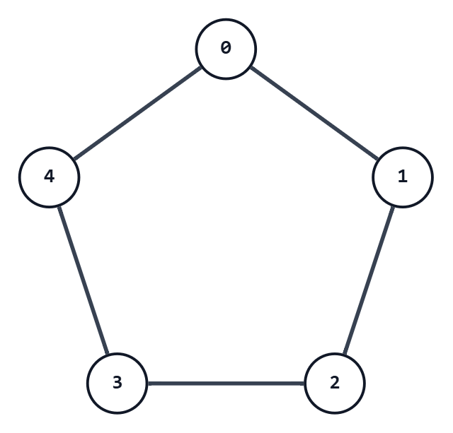

## 考え方



上の図は、5頂点のサイクルである。
このグラフ上において、任意の $i\neq j$ に対し、以下の性質が成り立つ。
（頂点番号は $\bmod 5$ で考える）
- 頂点 $i$ と頂点 $j$ が隣接しているとき、頂点 $2i$ と頂点 $2j$ は隣接していない
- 頂点 $i$ と頂点 $j$ が隣接していないとき、頂点 $2i$ と頂点 $2j$ は隣接している

これは、有限体 $F_5$ の、つまり $\mod{5}$ で全て計算する世界の性質である。

つまり、与えられたグリッドの値を全て $2$ 倍して $5$ で割った余りにすると、以下のようになる。
- 差が $1$ または $4$ であった組は、差が $2$ または $3$ になる
- 差が $2$ または $3$ であった組は、差が $1$ または $4$ になる

そして、今回与えられるグリッドにも変換後にも $0$ が存在しないので、差が $4$ には絶対にならない。
つまり、変換の結果は以下のようになる。
- 差が $1$ であった組は、差が $2$ または $3$ になる
- 差が $2$ または $3$ であった組は、差が $1$ になる

これは、問題の趣旨に合った変換であるので、解けている。

正直、ここまで考えなくても、$4$ つの数を適当に対応させる $4!$ 通りの中に正解があるか探せば見つかる。

## 入力例1での動作

入力を受け取る。

```text
n: 3
x:
1 2 3
2 1 4
1 3 2
```

各要素を $2$ 倍し、$5$ で割った余りを `result[i][j]` とする。
色ごとの変換は次のようになる。

| `x[i][j]` | `result[i][j]` |
|---:|---:|
| 1 | 2 |
| 2 | 4 |
| 3 | 1 |
| 4 | 3 |

したがって、`result` は次のようになる。

```text
result:
2 4 1
4 2 3
2 1 4
```

以上より、これを出力する。

## 注意点

特になし。

## 別解

特になし。
