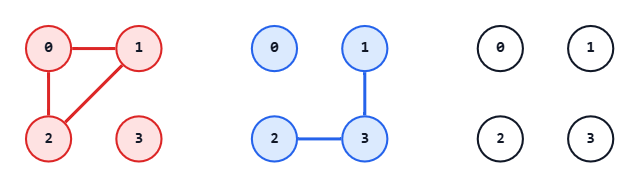
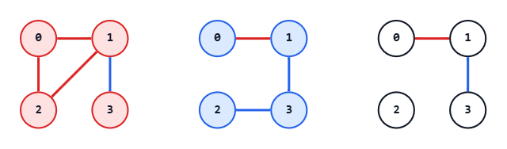
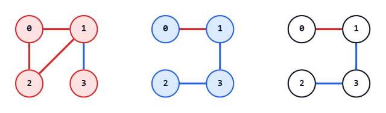

## 考え方

まず、重みの上限と下限を考える。

重みの下限は、重み $1$ の辺を最低限いくつ使わなければならないかである。
つまり、重み $0$ の辺だけで Union-find 木を作り、連結成分数 $-1$ がその答えである。
また、その重みの全域木を作れるかという問いにも、簡単に作れるといえる。
重み $0$ の辺でできた連結成分ごとに木を作り、その森を重み $1$ の辺で連結すればいい。

重みの上限は、重み $0$ の辺について同様に考えればよい。

さて、では下限が $L$ で上限が $U$ だった場合に $L \leq x \leq U$ の範囲の重み $x$ の全域木が全て作れるか？
これは、可能である。
以下、証明。

重み $L$ である全域木を $G_1$、重み $U$ である全域木を $G_2$、とする。
これらが作れることは証明済である。

最初のグラフとして、$G_1$ を用意する。
ここに、グラフが $G_2$ に一致するまで以下を繰り返す。

- $G_2$ に含まれるが現在のグラフに含まれない辺を $1$ つ選び、現在のグラフに加える
- 辺を加えたせいで、どこかにサイクルが発生している
- $G_2$ は木なので、サイクル中に $G_2$ に含まれない辺がある
- そのうち任意の $1$ つを取り除く

この操作は $G_2$ に一致するまで続けることができ、重みは一度に最大 $1$ しか増減しない。
したがって、$L \leq x \leq U$ の範囲の重み $x$ の全域木は全て作れる。

これで、`"Yes"` か `"No"` かで答える問題であれば解けた。
さて、では実際の構築を考える。
もちろん上の方法を実装できるならそれでもよいが、おそらく非常に難しい。

ということで、作れることがわかっている前提での作り方を実行する。

まず、重み $0$ の辺だけで Union-find 木を作ったとき、重み $1$ の辺が最低何本必要か考えた。
その最低限の個数の重み $1$ の辺の組の例を $1$ つ作り、それらの辺を全て採用する。
重み $1$ の辺だけで Union-find 木を作ったとき、重み $0$ の辺が最低何本必要かも考えた。
その最低限の個数の重み $0$ の辺の組の例を $1$ つ作り、それらの辺を全て採用する。

この時点で、$K$ が作れる範囲の数であれば、重さ $0$ の辺も重さ $1$ の辺も個数が超過はしていない。
そして、残った連結成分は、重み $0$ の辺だけでも、重み $1$ の辺だけでも、他の連結成分と連結できる。
ということは残りは、各重みの残り本数に気をつけて、連結成分を新しく結べる辺を自由に選んでよい。
重み $0$ も重み $1$ も、全体の重みを $K$ にするための規定本数になったら構築終了。

計算量は、1ケース当たり $O(M\alpha(N)+N\log N)$ である。

## 入力例1での動作

入力例1の $1$ つ目のテストケースのみ考える。

入力を受け取り、辺の両端を `0-indexed` に直す。

```text
n: 4
m: 5
k: 2
edges:
0: (0, 1, 0)
1: (0, 2, 0)
2: (1, 2, 0)
3: (3, 1, 1)
4: (3, 2, 1)
```

重み $0$ の辺だけで見た連結成分は $\{0,1,2\},\{3\}$ である。
したがって、重み $1$ の辺が最低 $1$ 本必要である。

重み $1$ の辺だけで見た連結成分は $\{0\},\{1,2,3\}$ である。
したがって、重み $0$ の辺も最低 $1$ 本必要である。



全域木は $3$ 本の辺からなる。
よって、その重みの合計は $1$ 以上 $2$ 以下にできる。
今回は $K=2$ なので構築可能である。

まず、各重みで最低限必要な辺を確保する。

重み $0$ の辺では、辺 $0$ が重み $1$ の辺だけでは別成分の頂点 $0,1$ を結ぶ。
よって、辺 $0$ を採用する。

重み $1$ の辺では、辺 $3$ が重み $0$ の辺だけでは別成分の頂点 $3,1$ を結ぶ。
よって、辺 $3$ を採用する。

この時点で採用した辺は $0,3$ で、連結成分は $\{0,1,3\},\{2\}$ である。
重み $0$ の辺は必要な $1$ 本を使い切り、重み $1$ の辺はあと $1$ 本使う必要がある。



残りの成分を、重み $1$ の辺で結ぶ。
辺 $4$ は頂点 $3,2$ を結ぶので採用できる。
これで全頂点が連結になり、採用した辺は $0,3,4$ となる。



辺番号を `1-indexed` に戻すと、$1,4,5$ を出力すればよい。

## 注意点

特になし。

## 別解

特になし。
