## 考え方

場合分けをして考える。

### $(\mathrm{i})$ $H$ と $W$ がともに偶数の場合
この場合、左上詰めで $2 \times 2$ の小正方形を並べれば、全体を埋め尽くすことができる。
これは明らかに最大値であるので、それを答えればよい。

### $(\mathrm{ii})$ $H$ は偶数で、$W$ が奇数の場合
マスの選び方の規則からして、各行各列から選べるマスは偶数個である。
つまり、この場合、各行 $W-1$ 個しか黒く塗ることはできない。

したがって、黒く塗れる個数は、高々 $H(W-1)$ 個である。
これは、左上詰めで $2 \times 2$ の小正方形を並べれば、達成可能である。

### $(\mathrm{iii})$ $H$ は奇数で、$W$ が偶数の場合
$(\mathrm{ii})$ の $H$ と $W$ が入れ替わっただけなので、同じ議論でよい。

### $(\mathrm{iv})$ $H=W$ の正方形で、それを $4$ で割った余りが $1$ である場合
これは、各行各列から少なくとも $1$ つ余りが出る。
それを行や列が重複しないように取ったとしても、黒く塗れる個数は高々 $H(H-1)$ 個。
そして、これは実現できる。

まず、縦横の中央ラインを除くと、辺長 $(H-1)/2$ の正方形 $4$ つになる。
これらはそれぞれ、$2 \times 2$ の小正方形 $(H-1)^2/16$ 個で埋めることができる。

その状態から、対角線を踏んでいる小正方形を時計回りに $1$ マス移動する。
移動先に別の小正方形があれば、中央ラインのところまで再帰的に押し出す。
（下にある動作例に、$9 \times 9$ の場合の画像あり）

これにより、対角線上、中央から偶数マスのところが全て白マスに戻った。
よって、ここに同心正方形を $(H-1)/4$ 個追加でとることができる。

以上で、正方形を $(H-1)^2/16\times 4+(H-1)/4 = H(H-1)/4$ 個取れた。
黒マスの個数は $H(H-1)$ 個となっており、これが最大値である。

### $(\mathrm{v})$ $H,W$ が異なる奇数で、小さい方を $4$ で割った余りが $1$ である場合
$H>W$ の場合を考える。
各行の黒マス数の考察により、黒く塗れる個数は高々 $H(W-1)$ 個。
そして、これは実現できる。

まず、上に $W \times W$ の正方形を取り、$(\mathrm{iv})$ の方法で塗る。
この時点で黒マスの個数は $W(W-1)$ 個となる。

その後、残りの $(H-W) \times W$ の領域は、$H-W$ が偶数であることから、$(\mathrm{ii})$ の方法で塗る。
追加で塗られる黒マスの個数は $(H-W)(W-1)$ 個となる。

両方を合わせて黒マスの個数は $H(W-1)$ 個となり、これが最大値である。

$H<W$ の場合も同様。

### $(\mathrm{vi})$ $H,W$ が異なる奇数で、小さい方を $4$ で割った余りが $3$ である場合
$H>W$ の場合を考える。
各行の黒マス数の考察により、黒く塗れる個数は高々 $H(W-1)$ 個。
しかし、黒マスの個数は $4$ の倍数でなくてはならない。
$H(W-1)$ は $4$ で割った余りが $2$ であるため、高々 $H(W-1)-2$ 個と修正できる。
そして、これは実現できる。

まず、左上に $(W-2) \times (W-2)$ の正方形領域を取り、ここを $(\mathrm{iv})$ の方法で埋める。
この時点で黒マスの個数は $(W-2)(W-3)$ 個となる。

その後、残りの領域を、右下詰めで $2 \times 2$ の小正方形を並べる。
これにより塗られる範囲は、$(H-1)\times (W-1)$ の長方形から $(W-3)^2$ の正方形を取り除いた部分。

両方を合わせて黒マスは $(W-2)(W-3)+(H-1)(W-1)-(W-3)^2 = H(W-1)-2$ 個。
これが最大値である。

$H<W$ の場合も同様。

### まとめ

以上の考察により、コードは $2$ 種類あれば全パターンに対応できる。

まず、少なくとも片方が偶数の場合。
これは、左上詰めで $2 \times 2$ の小正方形を並べればよい。

そして、両方が奇数の場合。
まず、$H,W$ の小さい方以下で、$4$ で割ると $1$ 余る最大数を探す。
その数を辺長に持つ正方形領域を左上に取り、$(\mathrm{iv})$ の方法で埋める。
そして、残りの領域は右下詰めで $2 \times 2$ の小正方形を並べればよい。

各テストケースの計算量は $O(HW)$。
全テストケースでは $O\left(\sum HW\right)$。

## 具体例での動作

ここでは、$H = 11$, $W = 13$ のテストケースを考える。
これらはともに奇数なので、両方が奇数の場合の処理を行う。

まず、$4$ で割って $1$ 余る最大内包正方形の辺の長さを求めると、$9$ である。

前半では、左上の $9 \times 9$ の範囲（下図の緑範囲）を構築する。

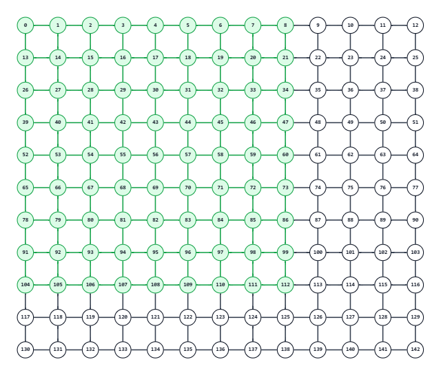

左上の $1/4$（下図の青範囲）では、$i = 1, 3$、$j = 1, 3$ を順に見る。

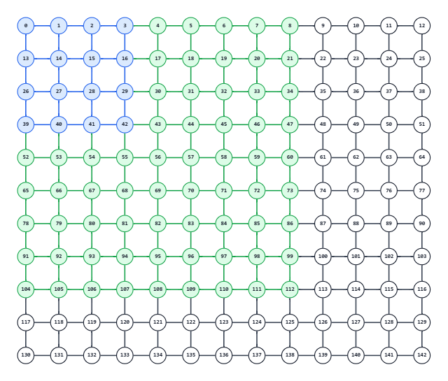

それぞれ、そこを左上とする $2\times2$ の正方形を採用する。
ただし、$i \leq j$ であれば、$1$ つ右にずらして採用する。
結果、次の $4$ 個（下図の赤と黄色）が追加される。

<!-- table-row-header: false -->
| $i$ | $j$ | $i \leq j$ | 実際の値 |
|---:|---:|:---:|:---|
| 1 | 1 | 真 | `(1, 2, 1)` |
| 1 | 3 | 真 | `(1, 4, 1)` |
| 3 | 1 | 偽 | `(3, 1, 1)` |
| 3 | 3 | 真 | `(3, 4, 1)` |

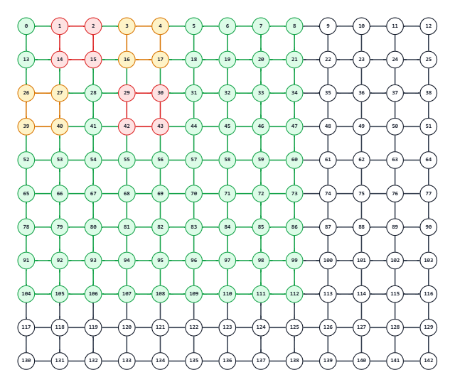

右上の $1/4$（下図の青範囲）では、$i = 1, 3$、$j = 6, 8$ を順に見る。

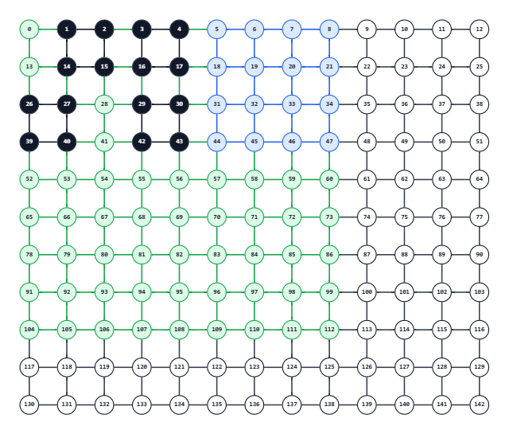

それぞれ、そこを左上とする $2\times2$ の正方形を採用する。
ただし、$i+j \geq 9$ であれば、$1$ つ下にずらして採用する。
結果、次の $4$ 個（下図の赤と黄色）が追加される。

<!-- table-row-header: false -->
| $i$ | $j$ | $i+j \geq 9$ | 実際の値 |
|---:|---:|:---:|:---|
| 1 | 6 | 偽 | `(1, 6, 1)` |
| 1 | 8 | 真 | `(2, 8, 1)` |
| 3 | 6 | 真 | `(4, 6, 1)` |
| 3 | 8 | 真 | `(4, 8, 1)` |

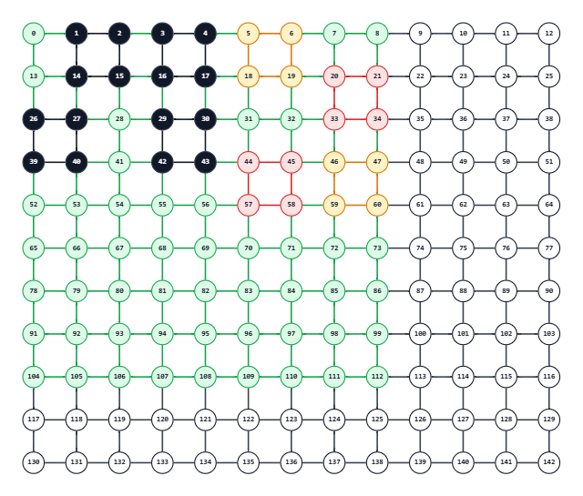

左下の $1/4$（下図の青範囲）では、$i = 6, 8$、$j = 1, 3$ を順に見る。

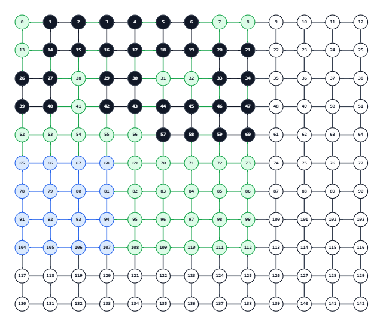

それぞれ、そこを左上とする $2\times2$ の正方形を採用する。
ただし、$i+j \leq 9$ であれば、$1$ つ上にずらして採用する。
結果、次の $4$ 個（下図の赤と黄色）が追加される。

<!-- table-row-header: false -->
| $i$ | $j$ | $i+j \leq 9$ | 実際の値 |
|---:|---:|:---:|:---|
| 6 | 1 | 真 | `(5, 1, 1)` |
| 6 | 3 | 真 | `(5, 3, 1)` |
| 8 | 1 | 真 | `(7, 1, 1)` |
| 8 | 3 | 偽 | `(8, 3, 1)` |

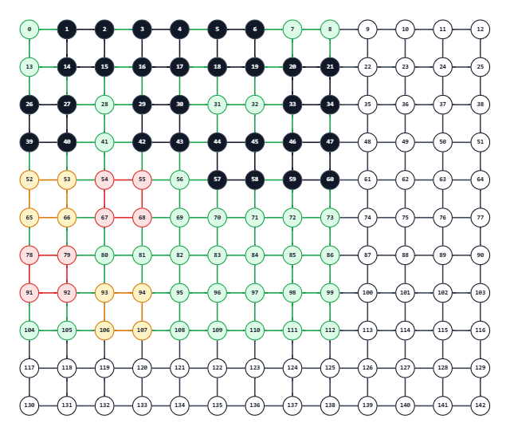

右下の $1/4$（下図の青範囲）では、$i = 6, 8$、$j = 6, 8$ を順に見る。

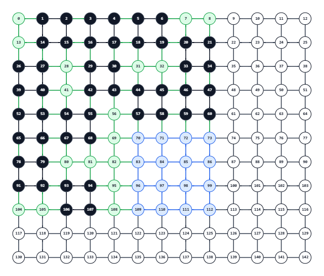

それぞれ、そこを左上とする $2\times2$ の正方形を採用する。
ただし、$i \geq j$ であれば、$1$ つ左にずらして採用する。
結果、次の $4$ 個（下図の赤と黄色）が追加される。

<!-- table-row-header: false -->
| $i$ | $j$ | $i \geq j$ | 実際の値 |
|---:|---:|:---:|:---|
| 6 | 6 | 真 | `(6, 5, 1)` |
| 6 | 8 | 偽 | `(6, 8, 1)` |
| 8 | 6 | 真 | `(8, 5, 1)` |
| 8 | 8 | 真 | `(8, 7, 1)` |

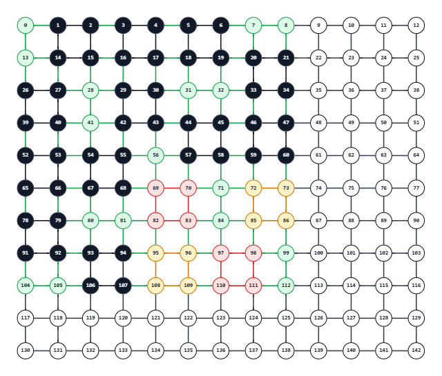

そして、対角線上の処理を行う。
$9 \times 9$ の中心から、対角線に沿って偶数マス行ったところにある頂点で正方形を作る（下図の赤と黄色）。
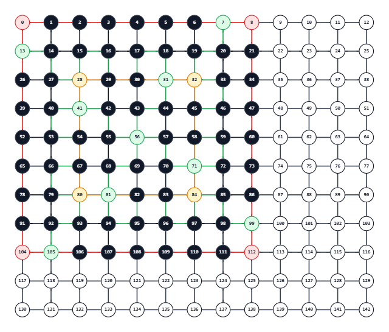


ここまでで、採用した正方形は $4 \times 4 + 2 = 18$ 個となる。

後半では、左上の $9 \times 9$ 以外の部分を埋める。
これは、右下詰めで、$2 \times 2$ の正方形を埋めればよい（下図の赤と黄色）。

```text
(2, 10, 1), (2, 12, 1)
(4, 10, 1), (4, 12, 1)
(6, 10, 1), (6, 12, 1)
(8, 10, 1), (8, 12, 1)
(10, 2, 1), (10, 4, 1), (10, 6, 1), (10, 8, 1), (10, 10, 1), (10, 12, 1)
```
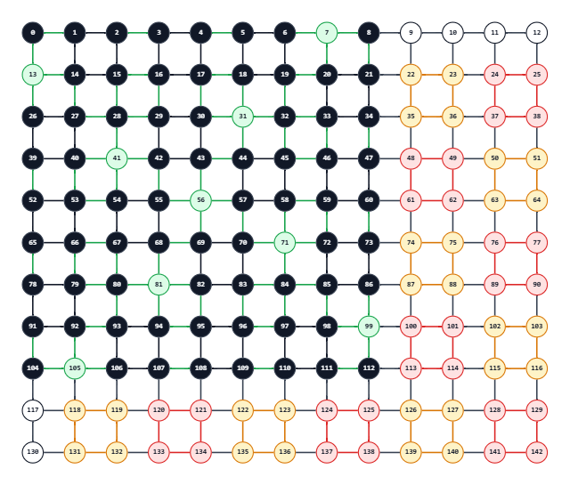

左上の $9 \times 9$ の範囲で $18$ 個、それ以外の範囲で $14$ 個追加したので、採用した正方形は $32$ となる。
実際の出力は次のようになる。

```text
32
1 2 1
1 4 1
3 1 1
3 4 1
1 6 1
2 8 1
4 6 1
4 8 1
5 1 1
5 3 1
7 1 1
8 3 1
6 5 1
6 8 1
8 5 1
8 7 1
1 1 8
3 3 4
2 10 1
2 12 1
4 10 1
4 12 1
6 10 1
6 12 1
8 10 1
8 12 1
10 2 1
10 4 1
10 6 1
10 8 1
10 10 1
10 12 1
```

## 注意点

特になし。

## 別解

特になし。
