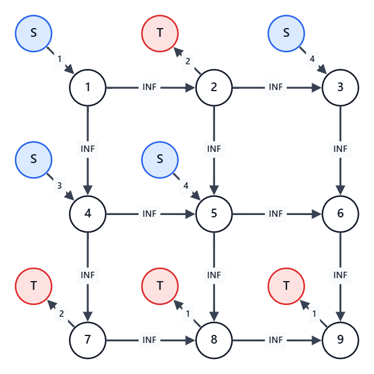

## 概要

有向グラフから、いくつかの頂点を選ぶことを考える。
ただし、頂点 $P$ から頂点 $Q$ へ辺が引かれていたら、頂点 $P$ を選ぶなら頂点 $Q$ も選ばなければならない。
このような条件を満たす頂点（というか部分グラフ）の選び方を閉包という。

有向グラフ上の各頂点に、得点が設定されている。
閉包を選んだときの、そこに含まれる頂点の合計得点の最大値を求める、という問題。

辺を逆にして「選ばない頂点を選ぶ」ことで、最小値も求められる。

一般化すると、プロジェクト選択問題になる。
（詳しくは「プロジェクト選択問題」を参照）

## 典型問題例

- [競技プログラミングの鉄則 B68 - ALGO Express](https://atcoder.jp/contests/tessoku-book/tasks/tessoku_book_eo)
  - ある駅を特急駅にするなら別の駅も特急駅にするという制約下で、利益の最大値を求める問題。
- [ABC472 G - Cascading Grid](https://atcoder.jp/contests/abc472/tasks/abc472_g)
  - マスを `#` にする操作による依存関係を閉包として扱い、`+` と `-` の得点差を最大化する問題。
- [ARC085 E - MUL](https://atcoder.jp/contests/arc085/tasks/arc085_c)
  - 倍数関係による選択制約を閉包として扱い、最小カットに帰着する問題。

## コード例

### 最大閉包問題を最大フローで解く（G問題以上レベル）

例えば、$3\times 3$ のグリッドに、以下のように得点が定められている。
ここからいくつかのマスを選ぶが、あるマスを選んだらその右と下のマスも選ばなければならない。
これは、$9$ 頂点 $12$ 辺の有向グラフで表されているというのと同じことである。
さて、選んだマスの得点合計の最大値は？
```txt
 1 -2  4
 3  4  0
-2 -1 -1
```

$9$ マスくらいであればbit全探索でも解けそうであるが、ここでは $500$ マスくらいでも解ける方法を考える。

まず事前に、制約を全く無視した場合の得点最大値を $1+4+3+4=12$ と求める。
もちろんこれは不正をして得た得点なので、実際このうちいくつかは諦めなくてはならない。
この、諦めたことによる損失を最小化することを考える。

これは、フローネットワークで制約を表現することで解くことができる。
具体的には、以下のように頂点および辺を用意する。
- $2$ 択の数 $+2$ 個の頂点を用意する。
  - 追加の $2$ 個は、フローの始点と終点の分
- 選ばないと損する選択について、始点から対応頂点に向かって、損失分を容量とする辺を引く
- 選ぶと損する選択について、対応頂点から終点に向かって、損失分を容量とする辺を引く
- 頂点 $P$ を選ぶなら頂点 $Q$ を選ぶ制約があれば、頂点 $P$ から頂点 $Q$ に向かって容量 $\infty$ の辺を引く

もし、絶対に選ぶ頂点があるなら、選ばないと $\infty$ 損するとみなす。
逆に、絶対に選んではいけない頂点があるなら、選ぶと $\infty$ 損するとみなす。

実際に作ったものが、下図。
ただし、$S$ は見やすさのために複数置いてあるが、実際には全ての $S$ は同一の頂点である。
$T$ についても同様。



このとき、$S\to 1\to 2\to T$ という $S$ から $T$ への流量 $1$ の経路ができている。
- $S\to 1$ の辺は、頂点 $1$ を選ばないと $1$ 損することを示している
- $1\to 2$ の辺は、頂点 $1$ を選んで頂点 $2$ を選ばないのは許されないことを示している
  - 許されないということを、$\infty$ 損することとして表現している
- $2\to T$ の辺は、$2$ を選ぶと $2$ 損することを示している

つまり、この経路が存在することは、制約無視により不当な利得を $1$ だけ得ていることを示している。
そして、これらの辺のうちの少なくとも $1$ つを削除することが、制約違反を解消することに対応する。
各所の $S$ から $T$ までの経路分だけ、同様に不当利益をあちこちから得ている。
（ただし、それらが互いに独立しているとは限らない）

ということで、全体からいくつか辺を削除することで、$S$ から $T$ への経路をなくせばよい。
そのときに受け入れなければならない損失は、削除した辺の容量合計。
つまり、最小カットの値が最小損失であるということである。
よって、事前に求めておいた制約を全く無視した場合の得点最大値から、それを引けばよい。

上の例の場合、最小カットは $S\to 1,7\to T,8\to T,9\to T$ を削除する場合の $5$ である。
よって、事前に求めた $12$ から $5$ を引いて、答えは $7$ となる。
このとき、各選択肢でどちらを選ぶべきかは、以下で判断できる。
- 削除後のグラフで $S$ からそこへたどり着ける頂点が、採用する頂点
- 同じく、たどり着けない頂点が、採用しない頂点

AtCoder library を使える場合は、`mf_graph` で解ける。
仮に $2$ 択が $n$ 個あった場合、以下のようなコードになる。

```cpp
// フローネットワークを用意、始点と終点分で2頂点追加しておく
mf_graph<long long> g(n+2);

// 各頂点での損得
for (int i=0; i<n; i++) {
  if (score[i]>0) {
    result += score[i];
    g.add_edge(n,i,score[i]);
  } else if (score[i]<0) {
    g.add_edge(i,n+1,-score[i]);
  }
}

// uを選ぶならvも選ばなければならない制約の反映
for (int j=0; j<m; j++) {
  g.add_edge(u[j],v[j],INF);
}

// フローを流して、最小カット分、すなわち受け入れる最小損失を結果から引く
result -= g.flow(n,n+1);

// 必要なら、残りで始点から到達できる頂点を調べる（末尾2つは始点用と終点用のダミーが入る）
vector<bool> reachable = g.min_cut(n);
```

### 最小閉包問題を解く（G問題以上レベル）

選ぶ、選ばない、を逆にすることで、最小閉包問題も解ける。
- $2$ 択の数 $+2$ 個の頂点を用意する。
  - これは特に変わらない
- 選ぶと損する選択について、始点から対応頂点に向かって、損失分を容量とする辺を引く
  - 「選ばないと損する」が「選ぶと損する」に変わる
- 選ばないと損する選択について、対応頂点から終点に向かって、損失分を容量とする辺を引く
  - 「選ぶと損する」が「選ばないと損する」に変わる
- 頂点 $P$ を選ぶなら頂点 $Q$ を選ぶ制約があれば、頂点 $Q$ から頂点 $P$ に向かって容量無限の辺を引く
  - $P\to Q$ が $Q\to P$ に変わる
  - つまり、「$Q$ を選ばないならば $P$ を選ばない」という制約と考える

最後は、制約無視で全て小さい側を選んだ場合の合計に、最小カットの値を足せばよい。

### 多くの $2$ 択の間に制約がある問題を解く（G問題以上レベル）

応用することで、選択肢 $A$ と選択肢 $B$ の $2$ 択がたくさんありその間に制約がある問題を解ける。
というか、実際に問題として出題されるのはほぼこの形である。

例えば、[競技プログラミングの鉄則 B68 - ALGO Express](https://atcoder.jp/contests/tessoku-book/tasks/tessoku_book_eo)の場合。
各駅を頂点、特急駅にする制約を辺、特急駅にした場合の利得を頂点に割り振られた得点と考える。
すると、これはまさしく最大閉包問題であり、あとは上の考え方を用いて解ける。

ただし、最大閉包問題で表せるのは、「ある頂点を選ぶならその行き先も選ぶ」という制約のみである。
「ある頂点を選ぶならその行き先は選べない」という制約は一般には表すことができない。

二部グラフに限れば、「ある頂点を選ぶならその行き先は選べない」もなんとかなる。
片側は「選択肢 $A$ を選ぶかどうか」、逆側は「選択肢 $B$ を選ぶかどうか」として割り当てればよい。
とはいえ、今度は「ある頂点を選ぶならその行き先も選ぶ」の方が表せなくなってしまうのだが。

### 二部グラフの安定集合と最小点被覆（G問題以上レベル）

安定集合とは、いくつかの頂点を選んで、選んだ頂点間を結ぶ辺が $1$ つもない状態になっていること。
そのときの頂点数が最大になるような選び方を考える問題が、最大安定集合問題である。
これは、一般には NP 困難であるが、二部グラフに限れば解ける。
つまり、前項の「ある頂点を選ぶならその行き先は選べない」を使えばよい。
頂点を選んだときのスコアは全て $1$ 点なので、二部グラフのどちら側なのかを判断して辺を作る。

最小点被覆とは、いくつかの頂点を選んで、全ての辺が選んだ頂点に接続された状態になっていること。
そのときの頂点数が最小になるような選び方を考える問題が、最小点被覆問題である。
言っていることが最大安定集合問題の逆なので、選ぶ選ばないの答えも完全に逆になっている。
つまり、二部グラフに限れば、全く同じ方法で解ける。

これらは、最大マッチングの側から見る方法もある。
こちらの見方の強みは、この二部グラフで頂点の重みという概念が混ざったとき。
最大閉包問題はもともと重みありきの考え方をしているので、拡張が自然に入れられる。

## 注意点

### `INF` の大きさ

容量無限の辺には、最小カットで切られることがない程度に大きい値を入れる。
選ぶかどうかを強制されることがなければ、正の得点の総和より大きい値であれば十分である。
そのため、問題によっては $10$ くらいでよい場合もある。
もっとも、`INF` が小さいことで得することは特にないのである程度は雑に大きめに設定してよい。

## 関連知識

### 最大フロー

最大フロー最小カット定理により、最大流量と最小カットの容量は等しい。
最大閉包問題では、制約を満たすために受け入れる最小損失を最小カットとして求めるために用いる。

### プロジェクト選択問題

各選択肢について選ぶ・選ばない場合の損得や、選択肢間の制約をフローネットワークで表す問題。
最大閉包問題を一般化したものとして考えることができる。
