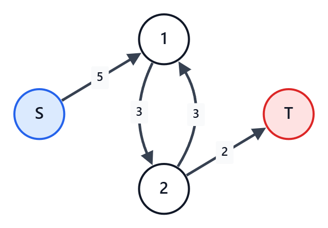

## 概要

選択肢 $A$ と $B$ がある $2$ 択が大量にある。
それぞれの $2$ 択で、$A$ を選ぶか $B$ を選ぶかで得点が設定されている。
さらに、$2$ つの $2$ 択の間で、組み合わせによる得点も設定されている。
その中で得点の最大値を求める問題。

ただし、どんな制約でも解けるわけではなく、任意の $2$ つの選択の組で以下が成り立つ必要がある。
- 両選択で同じ選択肢を選んだ場合の得点の和が、異なる選択肢を選んだ場合の和以上である

「燃やす埋める問題」と呼ばれることもある。

$2$ つの $2$ 択の間の得点を、「何もなし」「禁止（$-\infty$ 点）」だけにすると、最大閉包問題になる。
（この場合も、上述の制約を満たしている必要がある）
詳しくは「最大閉包問題」の記事参照。
本記事は、最大閉包問題は理解できているという前提で記述する。

## 典型問題例

- [ABC225 G - X](https://atcoder.jp/contests/abc225/tasks/abc225_g)
  - 各マスの $2$ 択と、斜めに隣接するマス間のコストを最小カットで扱う問題。
- [ABC193 F - Zebraness](https://atcoder.jp/contests/abc193/tasks/abc193_f)
  - 二部グラフとして片側の白黒を反転し、隣接マスの得点を最小カットで扱う問題。
- [ABC259 G - Grid Card Game](https://atcoder.jp/contests/abc259/tasks/abc259_g)
  - 各行・各列の $2$ 択と、各マスの得点・禁止条件を最小カットで扱う問題。

## コード例

### 異なる選択へのペナルティしかない問題を解く（G問題以上レベル）

基本的な発想は、最大閉包問題と同じである。
まず各選択肢単独での損得を、制約を無視して最大である方を選んだ場合の得点を求める。
しかし、これは不正に得た得点が含まれている。
そのため、フローネットワークでそれを表現し、不正解消のために受け入れる最小損失を考える。
この流れは変わらない。

最大閉包問題との違いは以下の点。

まず、選択肢の組み合わせによる得点設定の扱い。
最大閉包問題では、異なる選択をすることに対しての「何もなし」「禁止（$-\infty$ 点）」だけであった。
ここが、「$5$ 点のペナルティを受け入れるなら異なる選択をしてもよい」などになる。
それどころか、概要で述べた制限内で「異なる選択を選ぶなら $3$ 点ボーナス」などである場合もある。
そもそも、異なる場合のみではなく、「両方 $A$ だと $2$ 点ペナルティ」などもありえる。

とはいえ、これをいきなりすべて扱うと難しい。
そこで、まず「異なる選択をするとペナルティ」という形のみの場合を考える。

例えば、このような問題を考える。

```txt
左手を挙げると4点もらえるが、挙げないと1点失う。
右手を挙げると1点失うが、挙げないと1点もらえる。
そして、どちらか片手だけを挙げると、3点失う。
もらえる得点の最大値は？
```

この問題だけ解きたいなら $4$ パターンの得点を素直に計算すればよい。
しかし、ここではプロジェクト選択問題として考えてみよう。

まず、選択間の条件を全部無視して各選択のいい方を取った得点を出し、その後以下を行う。
- $2$ 択の数 $+2$ 個の頂点を用意する。
  - 追加の $2$ 個は、フローの始点と終点の分
- $A$ を選ばないと損する選択について、始点から対応頂点に向かって、損失分を容量とする辺を引く
  - $A$ を選ぶことで儲けになっている分、と考えてもよい
- $B$ を選ばないと損する選択について、対応頂点から終点に向かって、損失分を容量とする辺を引く
  - $B$ を選ぶことで儲けになっている分、と考えてもよい
- 選択 $P$ で $A$ 、選択 $Q$ で $B$ を選ぶとペナルティならば、$P\to Q$ にペナルティを容量とする辺を引く
  - 最大閉包問題では、ここが「引かない」か「容量 $\infty$ の辺を引く」しかなかった

上の手を挙げる問題であれば、以下のようになる。
まず、左手は挙げると $4$ 点、右手は挙げないと $1$ 点で、足して $5$ 点としておく。
そして、フローネットワークで以下の辺を作る。
左手の選択を頂点 $1$、右手の選択を頂点 $2$ としている。

- $S\to 1$ に容量 $5$ の辺
  - 左手は「挙げる」を選択することで、「挙げない」より $5$ 点得している
- $2\to T$ に容量 $2$ の辺
  - 右手は「挙げない」を選択することで、「挙げる」より $2$ 点得している
- $1\to 2$ に容量 $3$ の辺
  - 左手は「挙げる」、右手は「挙げない」を選択すると $3$ 点ペナルティ
- $2\to 1$ に容量 $3$ の辺
  - 右手は「挙げる」、左手は「挙げない」を選択すると $3$ 点ペナルティ



このフローネットワークにおいて、$S\to 1\to 2\to T$ の経路が成立している。
これは、以下のいずれかを受け入れなくてはいけないことを意味している。
- 左手を「挙げない」にして、$5$ の利得を諦める
- 左手を「挙げる」、右手を「挙げない」にして、$3$ のペナルティを受け入れる
- 右手を「挙げる」にして、$2$ の利得を諦める

今回であれば、この経路の最大流量は $2$ であり、つまり $2$ の利得を諦めるのが損失最小。
よって、得られる最大得点は、事前に求めた $5$ から損失最小値 $2$ を引いて、$3$ 点となる。

もっと複雑な制約になれば、あちこちで発生する損得が独立でない場合もある。
その場合でも、全体を表すフローネットワークを作り、最小カットを求めればそれが最小損失である。

このとき、各選択肢でどちらを選ぶべきかは、最大閉包問題と同じく、以下で判断できる。
- 削除後のグラフで $S$ からそこへたどり着ける頂点が、$A$ を選択する頂点
- 同じく、たどり着けない頂点が、$B$ を選択する頂点

AtCoder library を使える場合は、`mf_graph` で解ける。
仮に $A$ と $B$ の $2$ 択が $n$ 個あった場合、以下のようなコードになる。

```cpp
// フローネットワークを用意、始点と終点分で2頂点追加しておく
mf_graph<long long> g(n+2);

// 各選択での損得
for (int i=0; i<n; i++) {
  long long score_a = ; // Aを選ぶと得られる得点を入れる
  long long score_b = ; // Bを選ぶと得られる得点を入れる
  if (score_a>score_b) {
    result += score_a;
    g.add_edge(n,i,score_a-score_b);
  } else if (score_a<score_b) {
    result += score_b;
    g.add_edge(i,n+1,score_b-score_a);
  } else {
    result += score_a;
  }
}

// uでAを、vでBを選ぶペナルティの反映
for (int j=0; j<m; j++) {
  g.add_edge(u[j],v[j],penalty[j]);
}

// フローを流して、最小カット分、すなわち受け入れる最小損失を結果から引く
result -= g.flow(n,n+1);

// 必要なら、残りで始点から到達できる頂点を調べる（末尾2つは始点用と終点用のダミーが入る）
vector<bool> reachable = g.min_cut(n);
```

二部グラフの場合には、片方を反転させることで制約を満たすようにできる可能性がある。
「最大閉包問題」の記事参照。

### $2$ つの選択の間にもっと自由な条件がある場合の問題を解く（G問題以上レベル）

複数の選択の間の制約がもっと自由である場合を考える。
例えば、以下のような条件がある場合を考える。
表の値は、正の数ならボーナス、負の数ならペナルティ、$-\infty$ なら禁止である。

<!-- table-row-header: true -->
|  | 選択 $2$ は $A$ | 選択 $2$ は $B$ |
| --- | ---: | ---: |
| 選択 $1$ は $A$ | $x$ | $y$ |
| 選択 $1$ は $B$ | $z$ | $w$ |

ただし、冒頭に述べた制約通り、$x+w \geq y+z$ が満たされているものとする。

まず、$x$ が $-\infty$ である場合を特別処理する。
これは、$x+w \geq y+z$ という制約の扱いが難しくなる問題と、オーバーフロー回避のため。
この場合、$y$ か $z$ の少なくとも一方も $-\infty$ である。
よって、「$1$ では $A$ を選べない」または「$2$ では $A$ を選べない」の該当する方として処理する。
例えば前者なら、$1\to T$ に $\infty$ の辺を引き、$z$ と $w$ は $2$ の単独での利得に足してしまう。

同じように、$w$ が $-\infty$ である場合も特別処理をする。
方法は同様。
もしくは、$y$ や $z$ に使う $-\infty$ より絶対値が小さいものを用いて制約を無理矢理満たさせる。

いずれでもない場合、以下のように言い換えをすることで、フローネットワークに反映することができる。

まず、固定で $x$ 点もらってしまい、全てのパターンの得点から $x$ を引く。

<!-- table-row-header: true -->
|  | 選択 $2$ は $A$ | 選択 $2$ は $B$ |
| --- | ---: | ---: |
| 選択 $1$ は $A$ | $0$ | $y-x$ |
| 選択 $1$ は $B$ | $z-x$ | $w-x$ |

（これに加え、固定で $x$ 点）

そして、選択 $1$ で $B$ を選んだ場合、選択 $2$ にかかわらず $z-x$ 点もらうことにする。

<!-- table-row-header: true -->
|  | 選択 $2$ は $A$ | 選択 $2$ は $B$ |
| --- | ---: | ---: |
| 選択 $1$ は $A$ | $0$ | $y-x$ |
| 選択 $1$ は $B$ | $0$ | $w-z$ |

（これに加え、固定で $x$ 点、選択肢 $1$ が $B$ なら $z-x$ 点）

そして、選択 $2$ で $B$ を選んだ場合、選択 $1$ にかかわらず $w-z$ 点もらうことにする。

<!-- table-row-header: true -->
|  | 選択 $2$ は $A$ | 選択 $2$ は $B$ |
| --- | ---: | ---: |
| 選択 $1$ は $A$ | $0$ | $(y+z)-(x+w)$ |
| 選択 $1$ は $B$ | $0$ | $0$ |

（これに加え、固定で $x$ 点、選択肢 $1$ が $B$ なら $z-x$ 点、選択肢 $2$ が $B$ なら $w-z$ 点）

こうなると、$x+w \geq y+z$ という制約から、右上は $0$ 以下なので通常の条件として処理できる。
つまり、以下のように $4$ つの処理をすればよい。
- 固定で $x$ を足す（ペナルティ値を出した場合は引く）
- 選択肢 $1$ で $B$ を選んだ場合の利得に $z-x$ 点を足す（ペナルティ値を出した場合は引く）
- 選択肢 $2$ で $B$ を選んだ場合の利得に $w-z$ 点を足す（ペナルティ値を出した場合は引く）
- 頂点 $1$ から頂点 $2$ に容量 $(x+w)-(y+z)$ の辺を引く

この先は、通常のプロジェクト選択問題と同様である。
二部グラフの場合には、片方を反転させることで制約を満たすようにできる可能性があるのも同様。

## 注意点

`INF` の扱いに注意。
固定値足しこみに `INF` が混ざるとオーバーフローのリスクがある。
また、禁止が $2$ マスあるのを同じ `INF` にすると、数値上制約を満たさなくなってしまうことがある。
このあたりでバグを埋め込んでしまうと発見が難しいため注意すること。

また、フローを解くには計算量がかかり、頂点数が多い場合は `TLE` の可能性がある。
条件の入り方によってはフローなど用いなくても動的計画法などで解ける場合もある。
問題の形だけ見てフローを決めつけないこと。

## 関連知識

### 最大フロー

最大フロー最小カット定理により、最大流量と最小カットの容量は等しい。
プロジェクト選択問題では、受け入れる最小損失を最小カットとして求めるために用いる。

### 最大閉包問題

プロジェクト選択問題の特殊な場合で、選択間の得点が「何もなし」「禁止」に限られる場合に相当する。